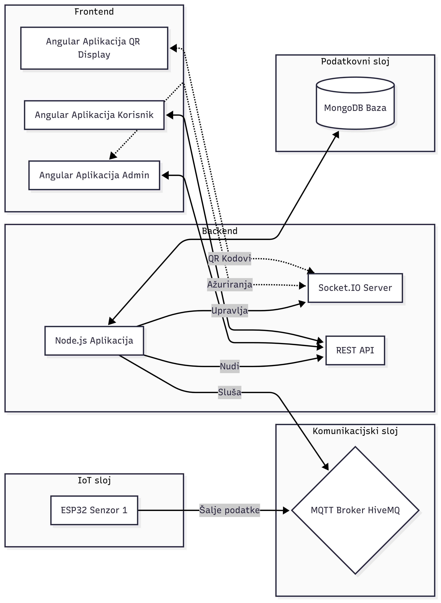
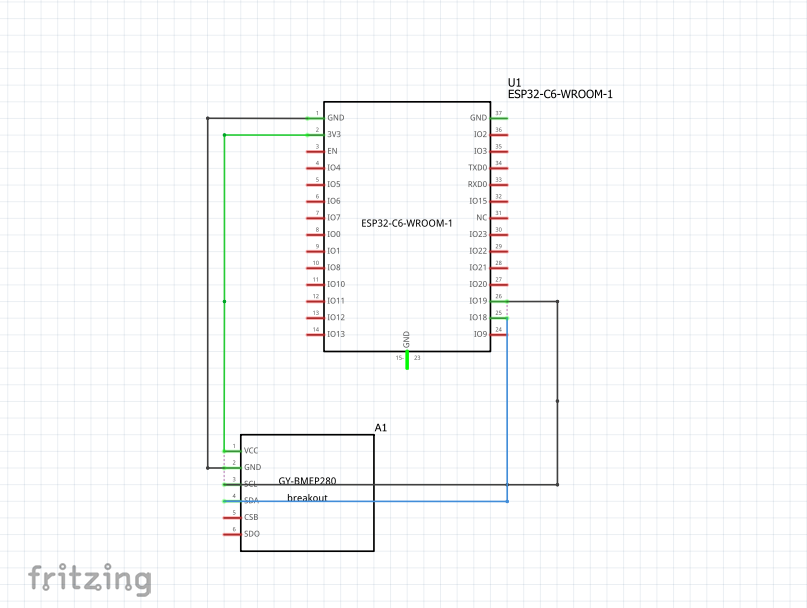

# Pametna teretana s primjenom IoT tehnologija

Sustav se sastoji od ugrađenog sustava i web aplikacije kako bi omogućio praćenje popunjenosti teretane, uvjeta u teretani i dodavanje/brisanje članova te prijavu u sustav preko QR koda.

## Funkcionalnosti 
- Praćenje temperature i tlaka: ESP32 mikrokontroler s BMP280 senzorom mjeri temperaturu i tlak zraka, podatci se šalju svakih 60 sekundi.
- Administratorska ploča: Mjesto za upravljanje sustavom koje prikazuje:
   - Broj članova u teretani u stvarnom vremenu
   - Podatke sa senzora
   - Lista svih korisnika gdje admin može pretraživati, dodavati i brisati korisnike
- Sustav prijave: Prijava putem dinamičkog QR koda koji se prikazuje na posebnom ekranu i mijenja se svakih 15 sekundi.
- Statistika: Stranica za admina koja prikazuje sve korisnike koji su taj dan posjetili teretanu (broji posjete svakog korisnika za taj dan i vrijeme ulaska i izlaska) te mjesečnu statistiku gdje piše koliko je koji korisnik posjetio teretanu na mjesečnoj bazi i to je
poredano od korisnika koji ima najviše posjeta prema onima što imaju najmanje.
- Korisnička ploča: Korisnik može vidjeti svoju povijest dolaza i koliko je drugih korisnika u teretani.

## Arhitektura Sustava




## Korištene tehnologije:
- Ugrađeni sustav
  - Mikrokontroler: ESP32 (ESP32C6 Dev Module u Arduine IDE)
  - Senzor: BMP280
  - Programski jezik: C++ (Arduino IDE)
- Backend (poslužiteljski dio):
  - Okruženje: Node.js
  - Framework: Express.js
  - Baza podataka: MongoDB (Mongoose ODM)
  - Komunikacija u stvarnom vremenu: Socket.io
  - IoT komunikacija: MQTT.js
  - Autentifikacija: JWT, bcrypts
- Frontend (klijentski dio):
  - Framework: Angular (sa standalone komponentama)
  - Stil: Bootstrap, SCSS

## Pokretanje projekta
Kako bi pokrenuli projekt lokalno potrebno je imati instaliran Node.js i npm. Također je potrebno okruženje za ESP32 mikrokontroler (npr. Arduino IDE) te račun na MongoDB Atlas i MQTT broker.

### Postavljanje backenda
```bash # Pozicioniranje u backend direktorij
cd web
cd gym-backend

# Instaliranje upravitelja paketa za Node.js
npm install

# Kreirajte .env datoteku u korijenu 'gym-backend' direktorija
# i unesite svoje podatke
# Potrebne varijable:
PORT (npr. PORT = 3000),
MONGO_URI - tu ide connection string
(npr. MONGO_URI = mongodb+srv://stranputhrvoje:<db_password>@cluster0.inu69pd.mongodb.net/?retryWrites=true&w=majority&appName=Cluster0),
gdje umjesto <db_password> ide zadana lozinka.
JWT_SECRET - tajna rijec za JSON Web Tokens.
MQTT_HOST - kopirati URL i dodati mqtts:// ako već nije tamo (npr. MQTT_HOST = mqtts://01474c2b69ac4bb1b42021127163ed17.s1.eu.hivemq.cloud).
MQTT_USER - ime korisnika kojeg smo napravili da ima pristup
MQTT_PASSWORD - lozinka tog korisnika 

# Pokrenite server
npm run dev
```
Server će se pokrenuti na http://localhost:3000.

### Postavljanje frontenda
```bash #U novom terminalu, pozicionirat se frontend direktorij
cd web
cd gym-frontend

# Instaliranje svih ovisnosti (--legacy-per-deps koristiti zbog nekompatibilnosti verzija)
npm install --legacy-peer-deps

# pokrenuti
ng serve
# kako bih koristio mobitel i imao pristup kameri zbog QR koda ja sam pokretao s
ng serve --host 0.0.0.0 --ssl
# tada će biti ispisane adrese u terminalu na kojima se može pristupiti web aplikaciji
# za računalo sam koristio prvu adresu koja je ispisana (npr. https://localhost:4200/)
# mobitel treba biti povezan na istu mrežu kao i računalo i za
# mobitel se koristi adresa koja je ispisana pod Network (npr. https://<ip_adresa>:4200/)

```
### Postavljanje ugrađenog sustava
- Otvoriti .ino datoteku
- Instalirati potrebne biblioteke (Adafruit BMP280, PubSubClient, ArduinoJson)
- U konfiguracijskim postavkama unijeti podatke o WiFi mreži i MQTT brokeru
- Spojiti ESP32 i BMP280 prema slici te spojiti ESP32 na računalo
  
- Postaviti na ESP32C6 Dev Module
- Prenijeti kod na ESP32
  

